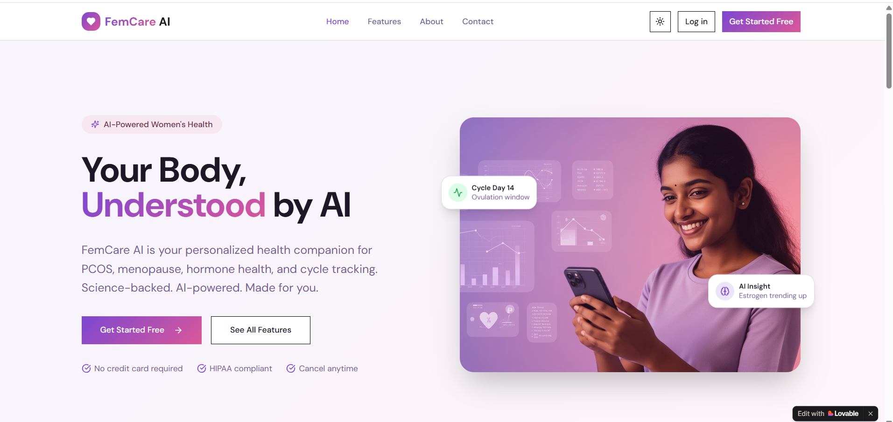
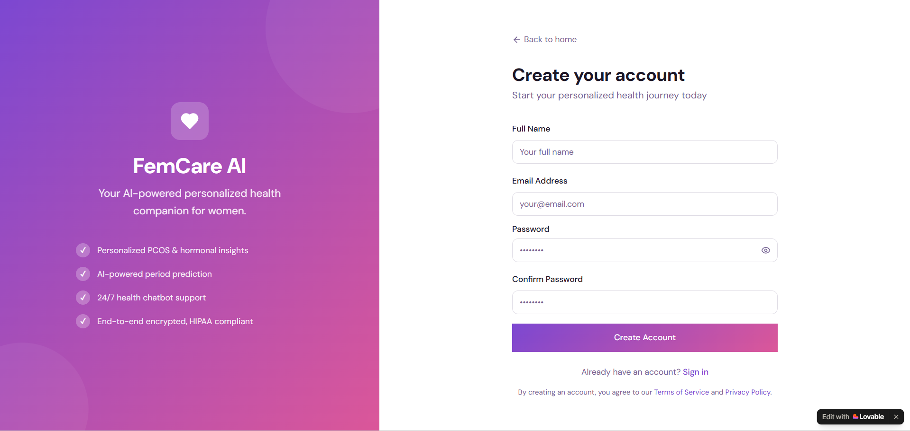

<p align="center">
  Digital Health • AI • PCOS & Menopause Management
</p>

# FemCare AI

AI-powered digital health platform for managing PCOS and menopause through intelligent tracking and predictive insights.

---

## Overview

FemCare AI is a digital health platform designed to support women managing hormonal conditions such as PCOS and menopause.

The platform combines structured health tracking with data-driven analysis to provide meaningful insights and improve long-term health outcomes.

---

## Problem

Hormonal health conditions affect a large number of women, yet current digital solutions are limited.

Most applications:

* Only track data without analysis
* Lack personalization
* Do not provide predictive insights
* Offer limited continuous guidance

This leads to reactive healthcare instead of proactive management.

---

## Solution

FemCare AI introduces a data-driven approach to healthcare by integrating tracking, analysis, and prediction.

The system:

* Collects health and lifestyle data
* Identifies patterns over time
* Generates insights
* Provides personalized recommendations

---

## Features

### Current

* Menstrual cycle tracking
* Symptom logging
* Health dashboard
* AI chatbot interface

### Planned

* Predictive analytics for cycle and symptoms
* Hormonal pattern estimation
* Wearable integration
* Consultation support

---

## System Design

The system follows a modular structure:

* **Frontend** → User interaction and data input
* **Backend** → Data processing and API handling
* **Database** → Storage of health records
* **AI Layer** → Pattern analysis and prediction

Detailed design available in:
`architecture/system-design.md`

---

## Workflow

1. User inputs health data
2. Data is stored and processed
3. AI models analyze trends
4. Insights and recommendations are generated

---

## Project Structure

```bash
FemCare-AI/
│
├── README.md
├── Docs/
├── UserInterface/
├── architecture/
└── future-scope/
```

---

## Demo

https://femcare-ai-01.lovable.app

---

## Screenshots




---

## Technology

### Current

* AI-assisted no-code platform (Lovable)

### Planned

* Frontend: React / Flutter
* Backend: Node.js / Firebase
* AI: Python (Machine Learning models)

---

## Future Scope

* Implementation of real AI models
* Improved prediction accuracy
* Integration with wearable devices
* Expansion to mobile platforms

Detailed roadmap:
`future-scope/roadmap.md`

---

## Author

Susanth Mohan Kamala

---

## Summary

FemCare AI presents a structured and intelligent approach to digital healthcare by combining tracking, analysis, and prediction to improve hormonal health management.
